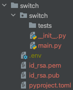
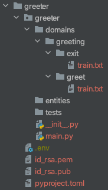
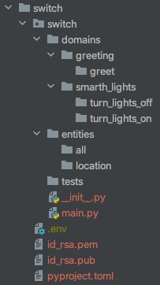
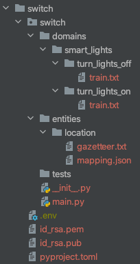

# Webex Skills SDK

The Webex Skills SDK is designed to simplify the process of creating a Webex Assistant Skill.
It provides some tools that help to easily set up a template skill, deal with encryption and 
test the skill locally, among other things.

In this document we'll go through some examples of how to use this SDK to create different types
of skills, and we'll also show how to use the different tools available.

## Overview

In this documentation we are going to look at the following topics:

- [Requirements](#requirements)
  - [Installing the SDK](#installing-the-sdk)
- [Simple Skills vs MindMeld Skills](#simple-skills-vs-mindmeld-skills)
  - [Simple Skills](#simple-skills)
  - [MindMeld Skills](#mindmeld-skills)
- [Building a Simple Skill](#building-a-simple-skill)
  - [Create the Skill Template](#create-the-skill-template)
  - [Running the Template](#running-the-template)
  - [Checking the Skill](#checking-the-skill)
  - [Invoking the Skill](#invoking-the-skill)
  - [Updating the Skill](#updating-the-skill)
  - [More About the Simple Skill Handler Signature](#more-about-the-simple-skill-handler-signature)
- [Building a MindMeld Skill](#building-a-mindmeld-skill)
  - [Invoking the MindMeld Skill](#invoking-the-mindMeld-skill)
  - [Building New Models](#building-new-models)
  - [Testing the Models](#testing-the-models)
  - [More About the MindMelmd Skill Handler Signature](#more-about-the-mindmeld-skill-handler-signature)
- [Converting a Simple Skill into a MindMeld Skill](#converting-a-simple-skill-into-a-mindmeld-skill)
  - [Adding the Training Data](#adding-the-training-data)
  - [Updating the Handlers](#updating-the-handlers)
  - [Testing the Skill](#testing-the-skill)
- [Encryption](#encryption)
  - [Generating Secrets](#generating-secrets)
  - [Generating Keys](#generating-keys)
- [Remotes](#remotes)
  - [Creating a Remote](#creating-a-remote)
  - [Listing Remotes](#listing-remotes)
- [Further Development and Deployment of your Skill](#further-development-and-deployment-of-your-skill)

## Requirements

In order to follow the examples in this guide, we'll need to install the SDK and its dependencies. Right now the SDK
works with Python 3.8 and above. Note that if you want to build a `MindMeld Skill` as shown later in the guide you will
have to use Python 3.8, since that is the only supported version for the `MindMeld Library`.

### Installing the SDK

For this guide, we assume you are familiar and have installed:
- [pyenv](https://github.com/pyenv/pyenv)
- [pyenv-virtualenv](https://github.com/pyenv/pyenv-virtualenv)
- [pip](https://pypi.org/project/pip/)
- [Poetry](https://python-poetry.org/)

We'll start by creating a virtual environment:

```bash
pyenv install 3.8.6
pyenv virtualenv 3.8.6 webex-skills
pyenv local webex-skills
```

We can now install the SDK using `pip`:

```bash
pip install webex-skills
```

We should be all set, we'll use the SDK later in this guide. You will need to work inside the `webex-skills` virtual
environment we just created.

## Simple Skills vs MindMeld Skills

In a nutshell, a skill is a web service that takes a request containing some text and some context,
analyzes that information and responds accordingly. The level of analysis done on that information
will depend greatly on the tasks the skills has to accomplish. Some skills will simply need to look
for keywords in the text, while others will perform complex NLP in order to understand what the user
is requesting.

This SDK has tooling for creating 2 types of skills: `Simple Skills` and `MindMed Skills`. These should 
serve as templates for basic and complex skills. Let's now take a look at these templates in detail.

### Simple Skills

`Simple Skills` do not perform any type of ML or NLP analysis on the requests. These skills are a good
starting point for developers to start tinkering with, and they are usually good enough for performing
trivial non-complicated tasks. Most developers would start with a `Simple Skill` and then migrate to a
`MindMed Skill` if needed.

Most of the time all you need is to recognize a few keywords in the text. Imagine a skill which only task
is to turn on and off the lights in the office. Some typical queries would be:

- "Turn on the lights" 
- "Turn off the lights" 
- "Turn on the lights please" 
- "Turn the lights off" 

In this particular case, it will probably be good enough to just look for the words `on` and `off` in the
text received. If `on` is present, the skill turns on the lights and responds accordingly and vice versa.

As you can imagine, we don't really need any complex NLP for this skill. A simple regex would be more
than enough. `Simple Skills` do just that: they provide a template where you can specify the regexes you
care about and have them map to specific handlers (`turn_on_lights` and `turn_off_lights` in our example).

We'll build a simple skill in [this section](#building-a-simple-skill)  

### MindMeld Skills

`MindMeld Skills` perform NLP analysis on the requests. These skills are a good template for cases where the
queries will have a lot of variation and contain a lot of information. 

Let's take the case of a skill for ordering food. Queries for a skill like this might look like the following:

- "Order a pepperoni pizza from Super Pizzas"
- "Order a pad thai from Thailand Cafe"
- "I want a hamburger with fries and soda from Hyper Burgers"

As we can see, using regexes for these cases can get out of hand really fast. We would need to be able to
recognize every single dish from every single restaurant, which might account for hundreds or thousands of regexes.
As we add more dishes and restaurants, updating the codebase becomes a real problem.

For cases like this, we leverage the open source [MindMeld Library](https://www.mindmeld.com/). This library makes
it really easy to perform NLP on any text query and identify entities like `dishes`, `restaurants` and `quantities`.
With that, performing the required actions becomes a much easier job.

We'll build a MindMeld skill in [this section](#building-a-mindmeld-skill)

## Building a Simple Skill

Let's now use the SDK to build a `Simple Skill`. As in the example above, we'll build a skill to turn lights on and
off according to what the user is asking. We are going to call this skill `Switch`.

### Create the Skill Template

In the `pyenv` environment we created before, run the following command:

```bash
webex-skills project init switch
```

This will create a template for a simple skill. You should see the following file structure:



As you can see, the `project` section `init` command creates a template of a skill. As usual, you can use the `--help
` option to see the documentation for this command:

```bash
$ webex-skills project init --help
Usage: webex-skills project init [OPTIONS] SKILL_NAME

  Create a new skill project from a template

Arguments:
  SKILL_NAME  The name of the skill you want to create  [required]

Options:
  --skill-path DIRECTORY      Directory in which to initialize a skill project
                              [default: .]

  --secret TEXT               A secret for encryption. If not provided, one
                              will be generated automatically.

  --mindmeld / --no-mindmeld  If flag set, a MindMeld app will be created,
                              otherwise it defaults to a simple app  [default:
                              False]

  --help                      Show this message and exit.
```

### Running the Template

We can now run our skill and start testing it. There are a couple ways you can run it. 

First this SDK has a `run` command, you can run it as follows:

```bash
webex-skills skills run switch
```

You should see an output similar to:
```bash
INFO:     Started server process [86661]
INFO:     Waiting for application startup.
INFO:     Application startup complete.
INFO:     Uvicorn running on http://127.0.0.1:8080 (Press CTRL+C to quit)
```

As usual, you can use the `--help` option to see the documentation for this command:

```bash
$ webex-skills skills run --help
Usage: webex-skills skills run [OPTIONS] SKILL_NAME

Arguments:
  SKILL_NAME  The name of the skill to run.  [required]

Options:
  --help  Show this message and exit.
```

The second option to run a skill is to use `uvicorn`. After all, the skill created is an `asgi` application based on
[FastAPI](https://fastapi.tiangolo.com/):

```bash
uvicorn switch.main:api --port 8080 --reload
```

You should see an output similar to the following:

```bash
INFO:     Will watch for changes in these directories: ['<PATH_TO_SKILL>']
INFO:     Uvicorn running on http://127.0.0.1:8080 (Press CTRL+C to quit)
INFO:     Started reloader process [86234] using statreload
INFO:     Started server process [86253]
INFO:     Waiting for application startup.
INFO:     Application startup complete.
```

Now that we have the skill actually run it, we can test it.

### Checking the Skill

One quick thing we can do before sending actual requests to the skill is to make sure we have everything correctly
setup. The sdk provides a tool for that. We can call it as:

```bash
webex-skills skills check switch
```

In your skill output, you should see something like this:
```bash
INFO:     127.0.0.1:58112 - "GET /check?signature=<SIGNATURE%3D&message=<MESSAGE>%3D HTTP/1.1" 200 OK
```

In the SDK output you should see:

```bash
switch appears to be working correctly
```

That means that your skill is running and the `check` request was successfully processed.

### Invoking the Skill

The SDK `skills` section has an `invoke` command which is used for sending requests to the skill. With the skill
running, we can invoke it as follows:

```bash
webex-skills skills invoke switch
```

We can now enter a command and see a response:
```bash
$ webex-skills skills invoke switch
Enter commands below (Ctl+C to exit)
>> hi
{ 'challenge': 'a129d633075c9c227cc4bdcd1653b063b6dfe613ca50355fa84e852dde4b198f',
  'directives': [ {'name': 'reply', 'payload': {'text': 'Hello I am a super simple skill'}, 'type': 'action'},
                  {'name': 'speak', 'payload': {'text': 'Hello I am a super simple skill'}, 'type': 'action'},
                  {'name': 'sleep', 'payload': {'delay': 10}, 'type': 'action'}],
  'frame': {},
  'history': [ { 'context': {},
                 'directives': [],
                 'frame': {},
                 'history': [],
                 'params': { 'allowed_intents': [],
                             'dynamic_resource': {},
                             'language': 'en',
                             'locale': None,
                             'target_dialogue_state': None,
                             'time_zone': 'UTC',
                             'timestamp': 1634881359},
                 'text': 'hi'}],
  'params': { 'allowed_intents': [],
              'dynamic_resource': {},
              'language': 'en',
              'locale': None,
              'target_dialogue_state': None,
              'time_zone': 'UTC',
              'timestamp': 1634881359}}
```

We can see that we got all the directives back. The template skill will simply repeat or echo everything we send to it.

As usual, you can use the `--help` option to see the documentation for this command:

```bash
$ webex-skills skills invoke --help
Usage: webex-skills skills invoke [OPTIONS] [NAME]

  Invoke a skill running locally or remotely

Arguments:
  [NAME]  The name of the skill to invoke. If none specified, you would need
          to at least provide the `public_key_path` and `secret`. If
          specified, all following configuration (keys, secret, url, ect.)
          will be extracted from the skill.


Options:
  -s, --secret TEXT         The secret for the skill. If none provided you
                            will be asked for it.

  -k, --key PATH            The path of the public key for the skill.
  -u TEXT                   The public url for the skill.
  -v                        Set this flag to get a more verbose output.
  --encrypt / --no-encrypt  Flag to specify if the skill is using encryption.
                            [default: True]

  --help                    Show this message and exit.
```

### Updating the Skill

Let's now modify our skill so it does what we want: remember we want this skill to turn on and off the office lights. 

Simply update the `main.py` file with the following 2 handlers:

```python
@api.handle(pattern=r'.*\son\s?.*')
async def turn_on(current_state: DialogueState) -> DialogueState:
    new_state = current_state.copy()

    text = 'Ok, turning lights on.'
    
      # Call lights API to turn on your light here.
    
    new_state.directives = [
        responses.Reply(text),
        responses.Speak(text),
        responses.Sleep(10),
    ]

    return new_state


@api.handle(pattern=r'.*\soff\s?.*')
async def turn_off(current_state: DialogueState) -> DialogueState:
    new_state = current_state.copy()

    text = 'Ok, turning lights off.'
    
    # Call lights API to turn off your light here.
    
    new_state.directives = [
        responses.Reply(text),
        responses.Speak(text),
        responses.Sleep(10),
    ]

    return new_state
```

The SDK provides the `@api.handle` decorator, and as you can see it can take a `pattern` parameter which is then
applied to the query to determine if the handler applies to the query being processed. This way, we can add
a few handlers by simple creating regexes that match the type of queries we want to support.

In the example above, we have added regexes to identify the `on` and `off` keywords. Which mostly tell what the user
wants to do.

By using the `skill invoke` command we can run a few tests:

```bash
>> turn on the lights
{ 'challenge': '56094568e18c66cb89eca8eb092cc3bbddcd64b4c0442300cfbe9af67183e260',
  'directives': [ {'name': 'reply', 'payload': {'text': 'Ok, turning lights on.'}, 'type': 'action'},
                  {'name': 'speak', 'payload': {'text': 'Ok, turning lights on.'}, 'type': 'action'},
                  {'name': 'sleep', 'payload': {'delay': 10}, 'type': 'action'}],
  'frame': {},
  'history': [ { 'context': {},
                 'directives': [],
                 'frame': {},
                 'history': [],
                 'params': { 'allowed_intents': [],
                             'dynamic_resource': {},
                             'language': 'en',
                             'locale': None,
                             'target_dialogue_state': None,
                             'time_zone': 'UTC',
                             'timestamp': 1634881502},
                 'text': 'turn on the lights'}],
  'params': { 'allowed_intents': [],
              'dynamic_resource': {},
              'language': 'en',
              'locale': None,
              'target_dialogue_state': None,
              'time_zone': 'UTC',
              'timestamp': 1634881502}}
>> turn off the lights
{ 'challenge': '2587110a9c97ebf9ce435412c0ea6154eaef80f384ac829cbdc679db483e5beb',
  'directives': [ {'name': 'reply', 'payload': {'text': 'Ok, turning lights off.'}, 'type': 'action'},
                  {'name': 'speak', 'payload': {'text': 'Ok, turning lights off.'}, 'type': 'action'},
                  {'name': 'sleep', 'payload': {'delay': 10}, 'type': 'action'}],
  'frame': {},
  'history': [ { 'context': {},
                 'directives': [],
                 'frame': {},
                 'history': [],
                 'params': { 'allowed_intents': [],
                             'dynamic_resource': {},
                             'language': 'en',
                             'locale': None,
                             'target_dialogue_state': None,
                             'time_zone': 'UTC',
                             'timestamp': 1634881502},
                 'text': 'turn on the lights'},
               { 'context': {},
                 'directives': [],
                 'frame': {},
                 'history': [],
                 'params': { 'allowed_intents': [],
                             'dynamic_resource': {},
                             'language': 'en',
                             'locale': None,
                             'target_dialogue_state': None,
                             'time_zone': 'UTC',
                             'timestamp': 1634881502},
                 'text': 'turn off the lights'}],
  'params': { 'allowed_intents': [],
              'dynamic_resource': {},
              'language': 'en',
              'locale': None,
              'target_dialogue_state': None,
              'time_zone': 'UTC',
              'timestamp': 1634881502}}
>> turn the lights on
{ 'challenge': 'ce24a510f6a7025ac5e4cc51b082483bdbcda31836e2c3567780c231e5674c59',
  'directives': [ {'name': 'reply', 'payload': {'text': 'Ok, turning lights on.'}, 'type': 'action'},
                  {'name': 'speak', 'payload': {'text': 'Ok, turning lights on.'}, 'type': 'action'},
                  {'name': 'sleep', 'payload': {'delay': 10}, 'type': 'action'}],
  'frame': {},
  'history': [ { 'context': {},
                 'directives': [],
                 'frame': {},
                 'history': [],
                 'params': { 'allowed_intents': [],
                             'dynamic_resource': {},
                             'language': 'en',
                             'locale': None,
                             'target_dialogue_state': None,
                             'time_zone': 'UTC',
                             'timestamp': 1634881502},
                 'text': 'turn on the lights'},
               { 'context': {},
                 'directives': [],
                 'frame': {},
                 'history': [],
                 'params': { 'allowed_intents': [],
                             'dynamic_resource': {},
                             'language': 'en',
                             'locale': None,
                             'target_dialogue_state': None,
                             'time_zone': 'UTC',
                             'timestamp': 1634881502},
                 'text': 'turn off the lights'},
               { 'context': {},
                 'directives': [],
                 'frame': {},
                 'history': [],
                 'params': { 'allowed_intents': [],
                             'dynamic_resource': {},
                             'language': 'en',
                             'locale': None,
                             'target_dialogue_state': None,
                             'time_zone': 'UTC',
                             'timestamp': 1634881502},
                 'text': 'turn the lights on'}],
  'params': { 'allowed_intents': [],
              'dynamic_resource': {},
              'language': 'en',
              'locale': None,
              'target_dialogue_state': None,
              'time_zone': 'UTC',
              'timestamp': 1634881502}}
```

In the examples above, we can see the skill responding with the correct message. In a real skill, we would also call an
API to actually perform the action the user wants.

### More About the Simple Skill Handler Signature

When we created our `Simple Skill`, our handler had the following siganture:

```python
async def greet(current_state: DialogueState) -> DialogueState:
```

You can also update the handler to give you another parameter:

```python
async def greet(current_state: DialogueState, query: str) -> DialogueState:
```

The `query` string parameter will give you the query that was sent to the skill, this can be used in cases where you
need to further analyze the text.

## Building a MindMeld Skill

When a skill is very complex and needs to handle many commands, usually the best approach is to create a MindMeld 
based skill. This will allow us to use NLP to better classify the request and extract important information we need
from it. We are not going to go very deep into how a MindMeld application works, but there are a lot of resources in the
official [MindMeld library](https://www.mindmeld.com/) site.

This SDK also has tooling in place for setting up a MindMeld based skill. For that, we can use the `project init`
command with the `--mindmeld` flag set. But first, we need to add the extra dependency `mindmeld`:

```bash
pip install "webex-skills[mindmeld]"
```

Let's create a skill called `greeter`:

```bash
webex-skills project init greeter --mindmeld
```

The folder structure should look like this:




### Invoking the MindMeld Skill

With the `greeter` skill running, let's try invoking it using the SDK `skills invoke` command:

```bash
$ poetry run webex-skills skills invoke greeter

Enter commands below (Ctl+C to exit)
>> hi
{ 'challenge': 'a31ced06481293abd8cbbcffe72d712e996cf0ddfb56d981cd1ff9c1d9a46bfd',
  'directives': [ {'name': 'reply', 'payload': {'text': 'Hello I am a super simple skill using NLP'}, 'type': 'action'},
                  {'name': 'speak', 'payload': {'text': 'Hello I am a super simple skill using NLP'}, 'type': 'action'},
                  {'name': 'sleep', 'payload': {'delay': 10}, 'type': 'action'}],
  'frame': {},
  'history': [ { 'context': {},
                 'directives': [],
                 'frame': {},
                 'history': [],
                 'params': { 'allowed_intents': [],
                             'dynamic_resource': {},
                             'language': 'en',
                             'locale': None,
                             'target_dialogue_state': None,
                             'time_zone': 'UTC',
                             'timestamp': 1634880182},
                 'text': 'hi'}],
  'params': { 'allowed_intents': [],
              'dynamic_resource': {},
              'language': 'en',
              'locale': None,
              'target_dialogue_state': None,
              'time_zone': 'UTC',
              'timestamp': 1634880182}}
```

As you can see, the response of a `MindMeld Skill` has the same shape as a `Simple Skill`, it's really just the internals
of the skill that change.

### Building New Models

Since `MindMeld Skills` use NLP, we need to retrain the ML models each time we modify the training data. The SDK
provides a the 'nlp build` command for this purpose:

```bash
webex-skills nlp build greeter
```

After running this, the models will be refreshed with the latest training data.

As usual, you can use the `--help` option to see the documentation for this command:

```bash
$ webex-skills nlp build --help
Usage: webex-skills nlp build [OPTIONS] [NAME]

  Build nlp models associated with this skill

Arguments:
  [NAME]  The name of the skill to build.

Options:
  --help  Show this message and exit.
```

### Testing the Models

Anothoer useful command in this SDK is the `nlp process` command. It's similar to the `skill invoke` command, in the 
sense that it will send a query to the running skill. However, the query will only be run through the NLP pipeline so
we can see how it was categorized. Let's look at an example:

```bash
$ webex-skills nlp process greeter

Enter a query below (Ctl+C to exit)
>> hi
{'domain': 'greeting', 'entities': [], 'intent': 'greet', 'text': 'hi'}
>>
```

You can see that now the response only contains the extracted ANLP pieces. This command is very useful for testing
your models as you work on improving them.

As usual, you can use the `--help` option to see the documentation for this command:

```bash
$ webex-skills nlp process --help
Usage: webex-skills nlp process [OPTIONS] [NAME]

  Run a query through NLP processing

Arguments:
  [NAME]  The name of the skill to send the query to.

Options:
  --help  Show this message and exit.
```

### More About the MindMeld Skill Handler Signature

When we created our `Simple Skill`, our handler had the following siganture:

```python
async def greet(current_state: DialogueState) -> DialogueState:
```

You can also update the handler to give you another parameter:

```python
async def greet(current_state: DialogueState, , processed_query: ProcessedQuery) -> DialogueState:
```

The `processed_query` parameter will give you the `text` that was sent to the skill, the `domain` and `intent` identified
as well as the `entities` extracted from the query. This can be useful in cases where you want to use the entities as
part of the skill logic. We'll show an example of this in the 
[Converting a Simple Skill into a MindMeld Skill](#converting-a-simple-skill-into-a-mindMeld-skill) section.

## Converting a Simple Skill into a MindMeld Skill

In many cases, when you start creating a new skill, you would probably start with a `Simple Skill`. As your skill grows
in complexity, you might need to convert it into a `Mindmeld Skill`. This SDK makes that conversion very easy, we are
going to take a look into that next.

Consider the [Switch Skill](#building-a-simple-skill) we built above. It really just recognizes if we want to turn 
something on or off. But what if we have multiple lights? We could in principle look at the query and try to extract
the light we want to switch with another regex, but that can be very brittle. Instead, let's try turning it into a 
`MindMeld Skill`.

### Adding the Training Data

Let's start by creating our domains, intents and entities. We still want to just turn on and off lights, but we want to
be able to identify which light to switch. On the `switch` app, create the following folder structure:



As you can see, we have created a `greeting` and `smart_lights` domains, the intents `greet`, `turn_lights_on`
and `turn_lights_off`, and the entities `all` and `location`. We now need to add training data to make this setup work.

Normally, you would need to collect training data manually to create your domain, intents and entities. But, for this
guide, we are going to take a shortcut. If you are familiar with the [MindMeld library](https://www.mindmeld.com/), you
have probably seen that it comes with `Blueprint` applications, so we are going to borrow some data from one of them.

Go to this [repo](https://github.com/CiscoDevNet/mindmeld-blueprints/tree/develop/blueprints/home_assistant/domains)
and copy the `train.txt` files from the corresponding intents into our folders. Do the same for entities, from 
[here](https://github.com/CiscoDevNet/mindmeld-blueprints/tree/develop/blueprints/home_assistant/entities) copy the 
corresponding `gazetteer.txt` and `mapping.json` files into our folders. Our directory should now look like this:



### Updating the Handlers

The next thing we'll do is to convert our logic to turn it into a `MindMeld Skill`. The steps are very simple, let's
start. We'll make all the following changes in `main.py`:

Instead of making the variable `app` a `SimpleApi`, make it a `MindMeldAPI`:
```python
api = MindmeldAPI()
```

In the `@api.handle` decorators, add the intent you want to handle instead of the pattern:

```python
@api.handle(intent='turn_lights_on')
async def turn_on(current_state: DialogueState, processed_query: ProcessedQuery) -> DialogueState:
...

@api.handle(intent='turn_lights_off')
async def turn_off(current_state: DialogueState, processed_query: ProcessedQuery) -> DialogueState:
```

Finally, add some logic to complement the response with the location entity if available. In the `turn_on` handler, 
replace the line:

```python
    text = 'Ok, turning lights on.'
```

With the following logic:

```python
    if len(processed_query.entities) > 0:
        entity = processed_query.entities[0]
        if entity['type'] == 'location':
            text = f'Ok, turning the {entity["text"]} lights on.'
        else:
            text = 'Ok, turning all lights on.'
    else:
        text = 'Ok, turning all lights on.'
```

Do the corresponding change to the `turn_off` handler.

You will also need to import the new classes you are using: `MindmeldAPI` and `ProcessedQuery`.

That's it! We now have NLP support in our skill. 

All in all your `main.py` should look like this:

```python
from webex_skills.api import MindmeldAPI
from webex_skills.dialogue import responses
from webex_skills.models.mindmeld import DialogueState, ProcessedQuery

api = MindmeldAPI()


@api.handle(default=True)
async def greet(current_state: DialogueState) -> DialogueState:
    text = 'Hello I am a super simple skill'
    new_state = current_state.copy()

    new_state.directives = [
        responses.Reply(text),
        responses.Speak(text),
        responses.Sleep(10),
    ]

    return new_state


@api.handle(intent='turn_lights_on')
async def turn_on(current_state: DialogueState, processed_query: ProcessedQuery) -> DialogueState:
    new_state = current_state.copy()

    if len(processed_query.entities) > 0:
        entity = processed_query.entities[0]
        if entity['type'] == 'location':
            text = f'Ok, turning the {entity["text"]} lights on.'
        else:
            text = 'Ok, turning all lights on.'
    else:
        text = 'Ok, turning all lights on.'

    # Call lights API to turn on your light here.

    new_state.directives = [
        responses.Reply(text),
        responses.Speak(text),
        responses.Sleep(10),
    ]

    return new_state


@api.handle(intent='turn_lights_off')
async def turn_off(current_state: DialogueState, processed_query: ProcessedQuery) -> DialogueState:
    new_state = current_state.copy()

    if len(processed_query.entities) > 0:
        entity = processed_query.entities[0]
        if entity['type'] == 'location':
            text = f'Ok, turning the {entity["text"]} lights off.'
        else:
            text = 'Ok, turning all lights off.'
    else:
        text = 'Ok, turning all lights off.'

    # Call lights API to turn off your light here.

    new_state.directives = [
        responses.Reply(text),
        responses.Speak(text),
        responses.Sleep(10),
    ]

    return new_state
```

### Testing the Skill

We can now test the skill to make sure it works as intended. Since we just added our training data, we need to build
the models first. Since we have entities defined, we will need to have Elasticsearch running for the `nlp build`
command to work properly. You can refer to the 
[MindMeld Getting Started Documentation](https://www.mindmeld.com/docs/userguide/getting_started.html) for a guide on
how to install and run Elasticsearch.

Remember that in order to build `MindMeld` skills we need the extra `mindmeld` dependency:

```bash
pip install "webex-skills[mindmeld]"
```

With that out of the way, you can build the models:

```bash
webex-skills nlp build switch
```

We can now run our new skill:

```bash
webex-skills skills run switch
```

Finally, we can use the invoke method to send a couple commands:

```bash
$ webex-skills skills invoke switch
Enter commands below (Ctl+C to exit)
>> hi
{ 'challenge': 'bd57973f82227c37fdaed9404f86be521ecdbefc684e15319f0d51bbecbb456e',
  'directives': [ {'name': 'reply', 'payload': {'text': 'Hello I am a super simple skill'}, 'type': 'action'},
                  {'name': 'speak', 'payload': {'text': 'Hello I am a super simple skill'}, 'type': 'action'},
                  {'name': 'sleep', 'payload': {'delay': 10}, 'type': 'action'}],
  'frame': {},
  'history': [ { 'context': {},
                 'directives': [],
                 'frame': {},
                 'history': [],
                 'params': { 'allowed_intents': [],
                             'dynamic_resource': {},
                             'language': 'en',
                             'locale': None,
                             'target_dialogue_state': None,
                             'time_zone': 'UTC',
                             'timestamp': 1634934720},
                 'text': 'hi'}],
  'params': { 'allowed_intents': [],
              'dynamic_resource': {},
              'language': 'en',
              'locale': None,
              'target_dialogue_state': None,
              'time_zone': 'UTC',
              'timestamp': 1634934720}}
>> turn on the lights
{ 'challenge': 'ff8e57bcb94b90c736e11dd79ae5fe3b269dcc450d7bb07b083de73d9a22d5e8',
  'directives': [ {'name': 'reply', 'payload': {'text': 'Ok, turning all lights on.'}, 'type': 'action'},
                  {'name': 'speak', 'payload': {'text': 'Ok, turning all lights on.'}, 'type': 'action'},
                  {'name': 'sleep', 'payload': {'delay': 10}, 'type': 'action'}],
  'frame': {},
  'history': [ { 'context': {},
                 'directives': [],
                 'frame': {},
                 'history': [],
                 'params': { 'allowed_intents': [],
                             'dynamic_resource': {},
                             'language': 'en',
                             'locale': None,
                             'target_dialogue_state': None,
                             'time_zone': 'UTC',
                             'timestamp': 1634934720},
                 'text': 'hi'},
               { 'context': {},
                 'directives': [],
                 'frame': {},
                 'history': [],
                 'params': { 'allowed_intents': [],
                             'dynamic_resource': {},
                             'language': 'en',
                             'locale': None,
                             'target_dialogue_state': None,
                             'time_zone': 'UTC',
                             'timestamp': 1634934720},
                 'text': 'turn on the lights'}],
  'params': { 'allowed_intents': [],
              'dynamic_resource': {},
              'language': 'en',
              'locale': None,
              'target_dialogue_state': None,
              'time_zone': 'UTC',
              'timestamp': 1634934720}}
>> turn off the kitchen lights
{ 'challenge': '300e7adfe2f199998f152793b944bc597c5145e991dda621e1495e2e06cebb6e',
  'directives': [ {'name': 'reply', 'payload': {'text': 'Ok, turning the kitchen lights off.'}, 'type': 'action'},
                  {'name': 'speak', 'payload': {'text': 'Ok, turning the kitchen lights off.'}, 'type': 'action'},
                  {'name': 'sleep', 'payload': {'delay': 10}, 'type': 'action'}],
  'frame': {},
  'history': [ { 'context': {},
                 'directives': [],
                 'frame': {},
                 'history': [],
                 'params': { 'allowed_intents': [],
                             'dynamic_resource': {},
                             'language': 'en',
                             'locale': None,
                             'target_dialogue_state': None,
                             'time_zone': 'UTC',
                             'timestamp': 1634934720},
                 'text': 'hi'},
               { 'context': {},
                 'directives': [],
                 'frame': {},
                 'history': [],
                 'params': { 'allowed_intents': [],
                             'dynamic_resource': {},
                             'language': 'en',
                             'locale': None,
                             'target_dialogue_state': None,
                             'time_zone': 'UTC',
                             'timestamp': 1634934720},
                 'text': 'turn on the lights'},
               { 'context': {},
                 'directives': [],
                 'frame': {},
                 'history': [],
                 'params': { 'allowed_intents': [],
                             'dynamic_resource': {},
                             'language': 'en',
                             'locale': None,
                             'target_dialogue_state': None,
                             'time_zone': 'UTC',
                             'timestamp': 1634934720},
                 'text': 'turn off the kitchen lights'}],
  'params': { 'allowed_intents': [],
              'dynamic_resource': {},
              'language': 'en',
              'locale': None,
              'target_dialogue_state': None,
              'time_zone': 'UTC',
              'timestamp': 1634934720}}
>> turn off all the lights
{ 'challenge': 'e92a90c304c9ef96a3edf31c6ffb10606739cdf98ad34cfd57314b20138ad59b',
  'directives': [ {'name': 'reply', 'payload': {'text': 'Ok, turning all lights off.'}, 'type': 'action'},
                  {'name': 'speak', 'payload': {'text': 'Ok, turning all lights off.'}, 'type': 'action'},
                  {'name': 'sleep', 'payload': {'delay': 10}, 'type': 'action'}],
  'frame': {},
  'history': [ { 'context': {},
                 'directives': [],
                 'frame': {},
                 'history': [],
                 'params': { 'allowed_intents': [],
                             'dynamic_resource': {},
                             'language': 'en',
                             'locale': None,
                             'target_dialogue_state': None,
                             'time_zone': 'UTC',
                             'timestamp': 1634934720},
                 'text': 'hi'},
               { 'context': {},
                 'directives': [],
                 'frame': {},
                 'history': [],
                 'params': { 'allowed_intents': [],
                             'dynamic_resource': {},
                             'language': 'en',
                             'locale': None,
                             'target_dialogue_state': None,
                             'time_zone': 'UTC',
                             'timestamp': 1634934720},
                 'text': 'turn on the lights'},
               { 'context': {},
                 'directives': [],
                 'frame': {},
                 'history': [],
                 'params': { 'allowed_intents': [],
                             'dynamic_resource': {},
                             'language': 'en',
                             'locale': None,
                             'target_dialogue_state': None,
                             'time_zone': 'UTC',
                             'timestamp': 1634934720},
                 'text': 'turn off the kitchen lights'},
               { 'context': {},
                 'directives': [],
                 'frame': {},
                 'history': [],
                 'params': { 'allowed_intents': [],
                             'dynamic_resource': {},
                             'language': 'en',
                             'locale': None,
                             'target_dialogue_state': None,
                             'time_zone': 'UTC',
                             'timestamp': 1634934720},
                 'text': 'turn off all the lights'}],
  'params': { 'allowed_intents': [],
              'dynamic_resource': {},
              'language': 'en',
              'locale': None,
              'target_dialogue_state': None,
              'time_zone': 'UTC',
              'timestamp': 1634934720}}
>>
```

We have now converted a `Simple Skill` into a `MindMeld Skill`.

## Encryption

Skills require encryption in order to safely send and receive requests. For the encryption to work properly, we need
to provide a key pair and a secret for our skills. As we saw in the [Simple Skill](#building-a-simple-skill) and
[MindMeld Skill](#building-a-mindMeld-skill) examples above, the keys and secret will be automatically created for us
when we use the SDK to create a template. However, the SDK also has tools to create these manually if we need to.

These tools are under the `crypto` section which we'll try next.

### Generating Secrets

Generating a secret is very simple, simply use the `generate-secret` command:

```bash
webex-skills crypto generate-secret
```

A secret will be logged to the terminal, which then you can add to your app.

### Generating Keys

Generating a key pair is very simple, simply use the `generate-keys` command:

```bash
webex-skills crypto generate-keys
```

A key pair will be created.

As usual, you can use the `--help` option to see the documentation for this command:

```bash
$ webex-skills crypto generate-keys --help
Usage: webex-skills crypto generate-keys [OPTIONS] [FILEPATH]

  Generate an RSA keypair

Arguments:
  [FILEPATH]  The path where to save the keys created. By default, they get
              created in the current directory.


Options:
  --name TEXT  The name to use for the keys created.  [default: id_rsa]
  --help       Show this message and exit.
```

## Remotes

This SDK also has the notion of `remotes`. That is, skills that are already running and even deployed somewhere, but
we still want to be able to test them using the SDK. 

The process for using remotes is very simple, we're going to look into that now. We'll use the `remote` section of the
SDK.

Remotes are automatically added for skills created with this SDK.

### Creating a Remote

You can create a remote by using the `create` command. Let's recreate a remote for a skill called `echo`:

```bash
webex-skills remote create echo
```

Follow the prompts to create a new remote:

```bash
$ webex-skills remote create echo

Secret: <SECRET>
Public key path [id_rsa.pub]: <KEY_PATH>
URL to invoke the skill [http://localhost:8080/parse]: <URL>
```

As usual, you can use the `--help` option to see the documentation for this command:

```bash
$ webex-skills remote create --help

Usage: webex-skills remote create [OPTIONS] NAME

  Add configuration for a new remote skill to the cli config file

Arguments:
  NAME  The name to give to the remote.  [required]

Options:
  -u TEXT            URL of the remote. If not provided it will be requested.
  -s, --secret TEXT  The skill secret. If not provided it will be requested.
  -k, --key PATH     The path to the public key. If not provided it will be
                     requested.

  --help             Show this message and exit.
```

### Listing Remotes

You can also list the remotes you currently have set up. For that you can use the `list` command:

```bash
webex-skills remote list
```

You will get something like:
```bash
{'echo': {'name': 'echo',
          'public_key_path': '<KEY_PATH>',
          'secret': '<SECRET>',
          'url': 'http://localhost:8080/parse'},
 'greeter': {'app_dir': '<APP_DIR>>',
             'name': 'greeter',
             'private_key_path': '<KEY_PATH>',
             'project_path': '<PROJECT_PATH>',
             'public_key_path': '<KEY_PATH>',
             'secret': '<SECRET>',
             'url': 'http://localhost:8080/parse'},
 'switch': {'app_dir': '<APP_DIR>>',
            'name': 'switch',
            'private_key_path': '<KEY_PATH>',
            'project_path': '<PROJECT_PATH>',
            'public_key_path': '<KEY_PATH>',
            'secret': '<SECRET>',
            'url': 'http://localhost:8080/parse'}}
```

As usual, you can use the `--help` option to see the documentation for this command:

```bash
$ run webex-skills remote list --help

Usage: webex-skills remote list [OPTIONS]

  List configured remote skills

Options:
  --name TEXT  The name of a particular skill to display.
  --help       Show this message and exit.
```

## Further Development and Deployment of your Skill

You might have noticed that when you create a new skill, there is a `pyproject.toml` file that gets added to the
project. This file already contains the dependencies needed to run the skill independently (without using the SDK's
`skills run` command.) 

In order to run the skill independently, you can use [Poetry](https://python-poetry.org/) to manage your dependencies,
or you can also replace the `pyproject.toml` with a `requirements.txt` file if you want to use 
[pip](https://pypi.org/project/pip/) instead.

For deployment, the SDK builds the skill based on [FastAPI](https://fastapi.tiangolo.com/), which offers multiple
options for running an app in production. You can find more information in their 
[Deployment Documentation](https://fastapi.tiangolo.com/deployment/).
