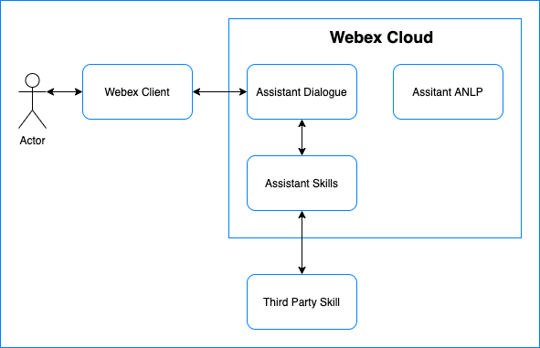

# Get Started with Assistant Skills

In this document we'll explore the steps needed to create your own Webex Assistant Skill. We'll go through the necessary components in high level, we'll create a sample Skill that will
echo back what a  user says and register that skill with the `Skills Service` so it can be used via the
Webex Assistant.

This document will be divided in sections that are independent of each other. This is with the intention
that if you only want to learn about certain parts of the process you can do so. You can also use this document
to refer back to any specific step later on.

We'll cover the following topics:

- [Skills architecture overview](#skills-architecture-overview)
- [Creating a sample Skill](#creating-a-sample-skill)
- [Registering a Skill on the `Skills Service`](#registering-a-skill-on-the-skills-service)
- [Further API Documentation](#further-api-documentation)

Feel free to go to any individual section by following the links above. Or just follow the
full document step by step and go through all the sections.

## Disclaimer

The `Skills Service` is still in development and there might be some changes in the next couple weeks. We'll try to
keep this documentation as up to date as possible.

Also, we are working on some tools that automate some steps you will need to do manually in this guide. So
we'll share these tools as well as they become available.

# Skills Architecture Overview

In order to better understand what we are doing in this guide, we'll start with a high level overview of how
the Webex Assistant Skills platform work within the `Webex Assistant` architecture. The following image is an overview of the architecture:



We'll start defining the different pieces of the system:
- `Actor`: A user invoking a Skill using the `Webex Assistant`.
- `Webex Client`: A supported client that can run the `Webex Assistant`, right now this is only available on
RoomOS devices like Roomkits and Desk Pros.
- `Assistant Dialogue`: This is what gets the request and decides how to handle it.
- `Assistant ANLP`: This is the part of the system that performs ML to analyze the user's query. In the case of
Skills though, this is not used. It's only shown here for completeness purposes.
- `Assistant Skills`: This is a cloud service that manages Skills created by third party developers like yourself.
- `Third Party Skill`: This is a cloud service developed by a third party. It's a service of its own but it's
registered on the `Assistant Skills` service in order to be used along with the `Webex Assistant`.

The flow works as follows:

1. The user wakes up the assistant and requests the use of a Skill, for example by saying:
   `OK Webex, tell Echo hello`.
2. The Webex client then forwards that request to the `Assistant Dialogue` service.
3. The `Assistant Dialogue` services analyzes the query and finds the user is trying to call a third party
Skill called `Echo` with the payload `hello`.
4. `Assistant Dialogue` checks with the `Assistant Skills` service to verify if this particular user has access to
the `Echo` Skill.
5. If the user has access to the given skill, the request goes to the `Assistant Skills` service for further
processing. If the requested Skill is not available for the user, then the request goes to `Assistant ANLP`
 for further processing.
6. The `Assistant Skills` service encrypts and signs the request and sends it to the `Third Party Skill` service hosted by a third-party developer.
7. The `Third Party Skill` service handles the request and produces a final response, which is then passed back via
the same pipeline to the client.

In this guide we'll be showing you how to create a `Third Party Skill` and using the `Assistant Skills` API to register it to the Webex service so it can be used via
`Webex Assistant`.

# Creating a Sample Skill

A Skill is an independent service or application that supports a given API, but it exists and runs outside
the Webex Assistant. Let's start building our own `Echo` skill, which is a skill that will  repeat back
what we say.

## Requirements

You need to have some basic requirements in order to better use this guide:

- Familiarity with Python.
- Familiarity with [pyenv](https://github.com/pyenv/pyenv#installation).
- Familiarity with [Poetry](https://python-poetry.org/) for dependency management
- Familiarity with [AIOHTTP](https://docs.aiohttp.org/en/stable) applications
- Familiarity with cloud services and REST APIs.
- For a better experience, you'll need access to a Webex RoomOS device in personal mode. This is can be a Roomkit
or a Desk Pro with the `Webex Assistant` enabled.

## Running the Skill

In order to simplify the tutorial, we have already written the code for you, but you still need to build
it and run it in order to use the Skill.

### Clone this repo

If you haven't done that yet, clone this repo:

```bash
git clone git@github.com:cisco/webex-assistant-sdk.git
```

### Create environment and install dependencies

Go into the `get_started_documentation/echo-skill` folder:

```bash
cd get_started_documentation/echo-skill
```

We'll be creating a new python environment using `pyenv`. We'll be using `Python 3.9.5` in this example:

```bash
pyenv install 3.9.5
pyenv local 3.9.5
```

Now install all dependencies with `Poetry`:

```bash
poetry install
```

At this point you should be able to run the app:

```bash
poetry run python echo_skill/main.py
```

You should see the app listening in port `8080.`

### Run a quick test

We can now emulate Webex Assistant passing a user query to your Skill by sending a sample request to the app. Using your favorite tool (curl, Postman, Paw, etc...) make
the following request:

```bash
POST http://0.0.0.0:8080
{
    "text": ["Hello world!"],
    "context": {},
    "params": {},
    "frame": {},
    "history": {}
}
```

Here is the  `CURL` example:

```bash
curl -X POST http://0.0.0.0:8080 -d'{"text": ["Hello world!"], "context": {}, "params": {}, "frame": {}, "history": {}}'
```

You should get a response like the following:

```json
{
    "directives": [
        {
            "name": "reply",
            "type": "view",
            "payload": {
                "text": "Hello world!"
            }
        },
        {
            "name": "speak",
            "type": "action",
            "payload": {
                "text": "Hello world!"
            }
        },
        {
            "name": "sleep",
            "type": "action",
            "payload": {}
        }
    ]
}
```

Congrats, you now have a skill that can be registered with the Webex Assistant!

### How does it work?

We'll now go into some of the details of what's happening in the code, so that if you create a new skill
you know what to expect.

### 1. How the app works

The app is a very simple server based on AIOHTTP. It only has one endpoint: `/`. Its simple purpose is to
receive a request that will eventually initiate from the Webex Assistant, will pass through the Skills Service
and will eventually reach this app.

The request contains the information we need to process in order to create our response. In our case this
is very simple, we do one of 2 things:

- Send back the same text that the user spoke.
- Send back a welcome message if the `target_dialogue_state` is equal to `skill_intro`.

Let's now dig a bit deeper into the request object.

### 2. Request payload

You can see that the request payload has a few parameters. We don't really use all of them in our echo app,
but here's a short explanation of what the usually contain and how they can be useful:

- `text`: This is what the user's query. Since this comes from an ASR engine, there are a few variations in
  the transcription, so they come in an array. The first entry is the most accurate transcription. However,
  we pass all transcriptions to the skill because they can be useful in some scenarios.
- `context`: Contains some information about how the user is making the request.
- `params`: Contains information like time_zone, timestamp of the query, language, etc... One particular
  field here is `target_dialogue_state` this can be used to tell us what the user intended to do. In this
  particular case, if the field is equal to `skill_intro`, we need to return an introductory message from the
  skill.
- `frame`: Contains information that needs to be preserved during multiple continuous interactions with
  the skill.
- `history`: Contains the history of the conversation in a multi-turn interaction.

Things like the `context`, `params`, `frame`, and `history` become more important in `Mindmeld` based
applications.

### 2. Response payload

Our skill needs to respond with something that the `Webex Assistant` can understand and act upon. In order
to make the assistant take any action, like show text on the screen or speak something back to the user, we
use what we call directives. You can see we send a list of directives in our response.

The following are the supported directives right now:

- `reply`: Shows some text in the screen.
- `speak`: Speaks the phrase using TTS.
- `listen`: Asks the assistant to listen and transcribe what the user is saying.
- `sleep`: Dismisses the assistant.
- `ui-hint`: Show a small hint at the bottom panel of the assistant to guide the user on things to say.
- `asr-hint`: Short phrases sent to the ASR engine to improve accuracy around the given vocabulary.
- `display-web-view`: Opens a web view with the specified URL.
- `clear-web-view`: Dismisses the web view.
- `assistant-event`: A generic event sent to the assistant, this can be used with macros on RoomOS devices.

So as you can see from the response, our skill is just telling the assistant to display and speak what the user
just said and then go to sleep.

# Registering a Skill on the Skills Service

Once you have a working skill, it needs to be deployed online in order for the `Skills Service` to reach it.

Now, for security reasons, we are requiring a few things on deployed skills, to make sure the communication
between the `Skills Service` and the skill is as secure as possible:

- Skills should run on HTTPS
- The request from the `Skills Service` will be encrypted and signed. The skill will be responsible for
  decrypting the content and verifying the signature.
- The encrypted content will contain a `challenge` which is a string that needs to be sent back
  to the service in the response.

If you already have a deployed skill that fills the requirements above, you can jump to the section
[Create Skill on Skills Service](#create-skill-on-skills-service). If you are using the sample Skill in this tutorial, we'll show you how to
fill in those details next and then how register the skill.

## Building Secure Echo Skill

You probably noticed there is another version of the `Echo` skill in the repo under `echo-skill-secure`. This
version has the encryption pieces we need in order to register it with the `Skills Service`. We decided to
provide 2 versions of the skill so that in the simple 'insecure' version we built earlier you can focus more
on the API pieces and quickly test things up. However, a real skill will be closer to the 'secure' version
of `Echo` which we'll look into now.

For starters, go into the `echo-skill-secure` folder and install its dependencies:

```bash
cd echo-skill-secure
pyenv local 3.9.5
poetry install
```

### Understanding the Encryption Flow

As mentioned above, the data in the request to the skill will be encrypted. The encryption is done using rsa keys
that have to be provided by you, the developer, at the moment you register your skill with the service. You only
provide the public key to the service, and then use the private key in the skill to decrypt the content.

In order for the service to know that the skill successfully decrypted the content, it includes a field in the
request called `challenge`. This is just a random string that needs to be included in the response from the skill.
If not included, the service will ignore the response and won't act on it.

The final piece is for the skill to make sure the request comes from the official `Skills Service` and not from
some other entity trying to exploit the skill. The headers of the request contain a signature, which is basically
a hash of the request, that was created using a `secret` which also needs to be provided by you, the
developer, at the moment you register your skill with the service. Using this secret, the skill can create its
own signature from the request and make sure the signature sent by the service matches.

With all the above the service verifies it's talking to the skill it's pretending to talk, and the skill can
verify the request comes from the official service.

Let's now look into how this is all done in the `secure` version of our `Echo` skill.

### Creating Secret and Keys

As mentioned before, we'll need a rsa private/public key pair as well as a `secret`. Let's make those now.

The `secret` is any string at least 22 characters long. You will have to create this yourself. Try following
the same rules you would follow to create a strong password. We have also provided a very simple tool
for creating a good secret under the `secret_generator` folder. If you want to use it, just do:

```bash
poetry run python secret_generator/main.py
```

Now in order to create the keys, we recommend following [this guide](https://docs.github.com/en/github/authenticating-to-github/connecting-to-github-with-ssh/generating-a-new-ssh-key-and-adding-it-to-the-ssh-agent#generating-a-new-ssh-key).
Make sure to create `rsa` type keys.

Finally, export the created secret and keys to your environment so they can be picked up by the skill and the
tester latter:

```bash
export ECHO_PUBLIC_KEY=<YOUR PUBLIC KEY>
export ECHO_PRIVATE_KEY=<YOUR PRIVATE KEY>
export ECHO_SECRET=<YOUR SECRET>
```

### Verifying the signature

The first thing you should do when receiving a request is verifying the signature is valid. You can take a look at
how that's done on the secure version of `Echo`. Here's the method we use for signature verification:

```python
def verify_signature(message: bytes, signature: bytes):
    secret_bytes = SECRET.encode('utf-8')
    _hmac = hmac.HMAC(secret_bytes, hashes.SHA256())
    _hmac.update(message)
    _hmac.verify(signature)
```

### Decrypting the Request's Message

After the signature has been verified, you can follow to decrypt the content of the request. You can take a look at
how that's done on the secure version of `Echo`. Here's the method we use for decrypting the message:

```python
def decrypt(message: bytes):
    # We expect our message to be a base64 encoded byte string of our cipher text
    key_bytes = PRIVATE_KEY.encode('utf-8')
    private_key = load_ssh_private_key(key_bytes, None)
    padding = OAEP(mgf=MGF1(algorithm=hashes.SHA256()),
                   algorithm=hashes.SHA256(), label=None)
    return private_key.decrypt(message, padding)
```

### Running the Skill

We run this skill similarly to how we did the `insecure` version:

```bash
poetry run python echo_skill_secure/main.py
```

### Testing the Skill

Since this skill is expecting an encrypted and signed request, it's not so easy to test. We have included a
simple tool to make testing a bit easier. You'll find this tool under the `echo_skill_secure_tester` directory.
At this point you can run this tool by simply doing:

```bash
poetry run python echo_skill_secure_tester/main.py
```

Note the dependencies have been included in the general `echo-skill-secure` project, so there's no need to
install anything extra.

If you take a look at the tester, you'll see that it's a very simple program that uses the skill's public key
and secret to sign and encrypt the request. It then sends the request and prints back the response from the
skill.

You can also use this tool alone to test your own skills.

Note that the skill can also take an environment variable: `ECHO_RUN_DEV_MODE`. When set to `true`, the skill skips
all the decryption and signing logic and basically becomes the `echo-skill` we tested first. This is a good
pattern to follow, so you can also test your skill in isolation from all the decryption and signature logic.

## Hosting Sample Skill Locally

Now that our skill is running securely, we can host it locally over https. For that we can use a service like
[localtunnel](https://localtunnel.github.io/www/). With the `secure` version of the `Echo` skill running, do:

```bash
npm install -g localtunnel
lt --port 8080
```

At this point we can go and create a new skill in the `Skills Service`.

## Create Skill on Skills Service

In this guide we are going to use the `Skills Service` API to do the creation of the skill manually. Later on
there will be more tools available to make this process easier.

### Get your Token and Developer ID

The simplest way to get this information is to login into [Webex for Developers](https://developer.webex.com/) and
then go to [this API endpoint](https://developer.webex.com/docs/api/v1/people/list-people).

In that page, you will see that you can simply copy your Authorization token, which will be valid for 12 hours.

If you don't know your developer/user id, you can also get it via this endpoint. Simple search for yourself
using your email and check the returned `id`. Note that this is base64 encoded, so you can go
[here](https://www.base64decode.org/) to decode it. The last part of the decoded URL will be your ID.
It should be a UUID.

### Make the Create Skill Request

Finally, we send a request to the service to create the skill. Using your tool of choice (curl, Postman,
Paw, etc...) make the following request (make sure to replace the values in <>):

```
POST https://assistant.us-east-2.intelligence.webex.com/skills/api/developers/<YOUR DEVELOPER ID>/skills
Authorization Bearer <YOUR TOKEN>
{
    "name": "Echo",
    "url": "<HTTPS URL>",
    "contact_email": "<YOUR EMAIL>",
    "languages": [
        "en"
    ],
    "secret": "<YOUR SECRET>",
    "public_key": "<THE SKILL'S PUBLIC KEY>"
}
```

Congratulations, at this point your skill is in the `Skills Service`!

At this point the skill will only be enabled for yourself and not for other people in your organization.

### Testing your Skill

The simplest way to test your skill end to end is by using a Cisco RoomOS device, like a Roomkit or a Desk Pro
in personal mode that has the `Webex Assistant` enabled.

First we need to make sure the feature toggle for the skills functionality is set for you. Using your tool of
choice (curl, Postman, Paw, etc...) make the following request (make sure to replace the values in <>):

```
POST https://feature-a.wbx2.com/feature/api/v1/features/users/<YOUR DEVELOPER ID>/developer
Authorization Bearer <YOUR TOKEN>
{
    "key": "webex-assistant-skills",
    "val": "true",
    "mutable": true,
    "type": "DEV"
}
```

# Further API Documentation

For further documentation on how to use the API of the `Skills Service` you can take a look at our swagger
documentation.

Simply go to their [online editor](https://editor.swagger.io/) and load the `openapi.json` file included in this
folder. You'll see the different available endpoints and more detailed description on how to use them. You can
even call the different endpoints from the editor.
